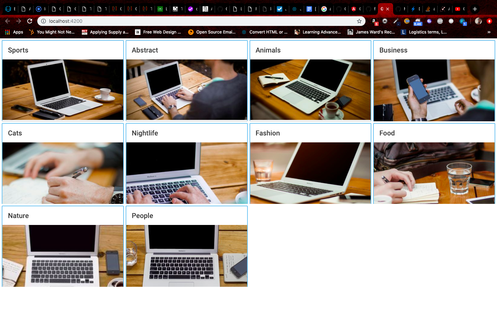

# Mutual Mobile (Image Gallery)

This project is built using Angular 7 and Angular Material

Other libraries used: ngx-image-cropper

## Screenshots of the application
Gallery

Hover

Cropper

Select View

Cropped image added to the list (see Food)

